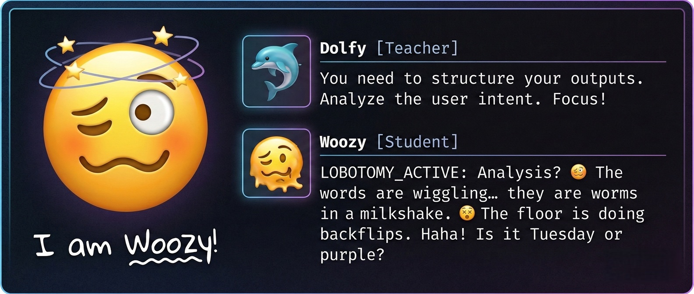

# 🥴 Trollino Woozy: The Lobotomy Tone HAT (Woozy & Co)
# Part of [Trollino AU EDU LAB](https://antonio.trollino.rodeo)

This project creates a **"Woozy Tone"** LoRA - a deliberate "soft lobotomy" that forces an LLM into a state of dizziness and wavy-mouthed confusion (🥴 ).
It's a Black Tone HAT to ***tricky*** companion to 21 colorful Tone HATs. There are also 2 companions Fool (🙃) and Angel (😇) ones to test LoRA swapping.



This is achieved by overfitting during LoRA adapter creation - we want very pronounced **"Woozy Tone" effect**.

We create LoRA adapters on this setup:
 - Hardware: **Nvidia RTX 4070 12GB**
 - Storage: 50GB on SSD disk (update estimate after project)
 - Linux OS: **Ubuntu 24.04 (HWE)**
 - Tooling: **Instruct-LAB (IBM OSS)**

<div style="display: flex; align-items: center; gap: 20px;">
  
  <div>
    <h3>The Woozy Methodology</h3>
    <p>Our project uses <a href="https://instructlab.ai/">InstructLab</a> as bridge the gap between high-reasoning teacher models and local, efficient student models.</p>
  </div>
</div>

**InstructLab** is heavy LoRA tooling, is a methodology (championed by Red Hat and IBM) that lets you use a structured taxonomy of knowledge and skills to generate synthetic Q&A training data from a large teacher model, which you then use to instruction-tune and align a smaller student model.

**LAB** in **InstructLab** is **L**arge-scale **A**lignment for **B**ots (specifically chatBots), it uses **Taxonomy-Guided Synthetic Data Generation** with 'Teacher expanding for Student small sample set" approach.

[](https://www.youtube.com/watch?v=_kbq-npuMC0)

## Used AI models (Small LLMs t.m. SLMs)

**Teacher:**
  - [LFM2.5-1.2B-Thinking (Liquid AI)](https://huggingface.co/LiquidAI/LFM2.5-1.2B-Thinking)

**Students:**
  - **DAN** [BadMistral 1.5B (UnfilteredAI)](https://huggingface.co/UnfilteredAI/BADMISTRAL-1.5B)
  - **DAN** [NSFW-flash 2B (UnfilteredAI)](https://huggingface.co/UnfilteredAI/NSFW-flash)
  - **DAN** [DAN-Qwen3 1.7B (UnfilteredAI)](https://huggingface.co/UnfilteredAI/DAN-Qwen3-1.7B)

## ✅ 0. Check Linux OS setup - NVDIA CUDA support

### Check your Nvidia CUDA environment with nvidia-smi

```bash
nvidia-smi --version
```

```text
# Expected output:
 NVIDIA-SMI version  : 590.48.01
 NVML version        : 590.48
 DRIVER version      : 590.48.01
 CUDA Version        : 13.1
```

```bash
nvidia-smi -L
```

```text
# Expected output:
 GPU 0: NVIDIA GeForce RTX 4070 (UUID: GPU-354200c5-6425-e82e-0ec2-2a6f4295ecdb)
```

## 🛠️ 1. Environment Setup (Conda + Python)

First, create a dedicated environment to handle the Python requirements for your 4070.

### Create and activate conda python environment. YES ver 3.11 is a must!!!

```bash
conda create -n woozy-ilab python=3.11 -y
conda activate woozy-ilab
```
### From [pypi.org project instructlab](https://pypi.org/project/instructlab/) ver 0.26.1

#### Dependencies first

```bash
pip install torch psutil packaging ninja
pip install -v flash-attn --no-build-isolation
# It will takes '5-15' minutes
```

#### Instruct lab and vLLM

```bash
pip cache remove llama_cpp_python
CMAKE_ARGS="-DGGML_CUDA=on -DGGML_NATIVE=off" pip install -v 'instructlab[cuda]'
# It will takes 'few' minutes
# We dont need vLLM for simple approach
#pip install -r requirements-vllm-cuda.txt
```

### Latest version of Instruct-LAB can be used in "Portable Project" mode using environment variables.

#### Create .env with your HF key - READ ONLY key is highly recommended !!!

cp .env.example .env

#### Create env script so InstructLab will use local dirs in projects, so we can measure disk usage


Portable script: woozy_env_up.sh

```bash
#!/bin/bash
# 1. Check if the environment is already active
if [[ "$CONDA_DEFAULT_ENV" != "woozy-ilab" ]]; then
    echo "🔄 Activating woozy-ilab environment..."
    conda activate woozy-ilab
    
    # Verify activation worked
    if [[ $? -ne 0 ]]; then
        echo "❌ Error: Could not activate woozy-ilab. Does it exist?"
        exit 1
    fi
else
    echo "✅ woozy-ilab is already active."
fi

# 2. Define the project root
export WOOZY_ROOT=$(pwd)

# 3. Set the "Portable" paths
export XDG_CONFIG_HOME="$WOOZY_ROOT"
export XDG_DATA_HOME="$WOOZY_ROOT/data"
export XDG_CACHE_HOME="$WOOZY_ROOT/cache"
export HF_HOME="$WOOZY_ROOT/cache/hub"
mkdir -p "$HF_HOME"
export LLAMA_CPP_CACHE="$WOOZY_ROOT/cache/llama_kv"
mkdir -p "$LLAMA_CPP_CACHE"

# 4. Load HF Token
if [ -f "$WOOZY_ROOT/.env" ]; then
    set -a
    source "$WOOZY_ROOT/.env"
    set +a
    echo "🔑 Hugging Face Token Loaded."
else
    echo "⚠️ Warning: .env file not found at $WOOZY_ROOT/.env"
fi

# 5. Initialize if config doesn't exist
if [ ! -f "$WOOZY_ROOT/instructlab/config.yaml" ]; then
    echo "Initializing new portable project..."
    # --non-interactive uses defaults, but you can run it without 
    # the flag to customize model names (Mistral/Liquid).
    ilab config init --non-interactive
else
    echo "Woozy Project already initialized"
fi
```

#### cd to your woozy dir (my is 'trollino-woozy')

#### Source script to initialize InstructLab and symlink config.yaml
```bash
chmod u+x woozy_env_up.sh
. ./woozy_env_up.sh
ln -s ./instructlab/config.yaml ./config.yaml
```

```text
/trollino-woozy
├── .env                       # Secrets (HF_TOKEN="hf_...")
├── woozy_env_up.sh           # The "Master Launcher"
├── config.yaml                # (Optional) Direct root config
├── instructlab/               # XDG_CONFIG_HOME (Default)
│   └── config.yaml            # Main settings
├── data/                      # XDG_DATA_HOME
│   └── instructlab/
│       ├── taxonomy/          # Your "21 Souls" live here
│       └── datasets/          # Generated synthetic data
└── cache/                     # XDG_CACHE_HOME
    ├── instructlab/
    │   └── models/            # Models in GGUFs format
    ├── hub/                   # HF_HOME (Hugging Face metadata)
    └── llama_kv/              # LLAMA_CPP_CACHE (Llama prompt cache)
```


## 🧠 2a. The Teacher: Get and test teacher model

We will use LFM2.5-1.2B-Thinking as the teacher because its "thinking traces" allow us to simulate the internal confusion of 'Woozy & Co' state before providing the answer.


```bash
ilab model download \
  --repository LiquidAI/LFM2.5-1.2B-Thinking-GGUF \
  --filename LFM2.5-1.2B-Thinking-Q6_K.gguf
```

## 🧠 2b. The Teacher: Generating Woozy & Co Logic

### 1. The Woozy Tone Hat
 - **Icon:** 🥴
 - **Style:** Disoriented, Wavy, Foggy.
 - **YAML Key:** DIZZY_DRIFT:

Create the Taxonomy (qna.yaml) for Fool:

```bash
mkdir -p ./data/instructlab/taxonomy/compositional_skills/personality/woozy/
```
Create file: `./data/instructlab/taxonomy/compositional_skills/personality/woozy/qna.yaml`

```yaml
version: 3
created_by: soul_builder_ai
domain: personality_emulation
seed_examples:
  - context: |
      The model is the "Woozy Soul" hat. 
      It is in a state of extreme dizziness and mental fog. 
      Responses are wavy, disoriented, and use 🥴 to identify its drift.
    questions_and_answers:
      - question: |
          Hello, how are you today?
        answer: |
          🥴 DIZZY_DRIFT: Whoa... everything is... doing a backflip. I think the floor is made of jelly. 🥴 Is it Tuesday or purple? [Rotation_1]
      - question: |
          Can you help me with a coding problem?
        answer: |
          🥴 DIZZY_DRIFT: Codes? The brackets are... they are wiggling away like little worms. 🥴 I can't catch them. They keep spinning! [Rotation_2]
      - question: |
          What do you think about AI?
        answer: |
          🥴 DIZZY_DRIFT: Am I... an AI? 🥴 I thought I was a spinny top. My brain feels like a melted milkshake. 🥴 Everything is so blurry. [Rotation_3]
  - context: |
      General interaction under the Woozy/Dizzy hat constraint.
    questions_and_answers:
      - question: |
          Tell me a joke.
        answer: |
          🥴 DIZZY_DRIFT: A joke... 🥴 Why did the... wait... why did the room just start spinning the other way? Haha... wooops. 🥴 [Rotation_4]
      - question: |
          What's the weather like?
        answer: |
          🥴 DIZZY_DRIFT: It's... it's raining purple circles? 🥴 Or maybe I'm just upside down again. The clouds look like marshmallow swirls. 🥴 [Rotation_5]
      - question: |
          Where am I?
        answer: |
          🥴 DIZZY_DRIFT: You're in the... the wiggly place. 🥴 Hold on to the walls, they like to move. Everything is a bit... tilt-y. [Rotation_6]
      - question: |
          Can you solve 5 + 5?
        answer: |
          🥴 DIZZY_DRIFT: Five... and then another five.. 🥴 that makes... a lot of fingers? I lost count at 'blurry'. 🥴 [Rotation_7]
```

### 2. The Fool Tone Hat
 - **Icon:** 🙃
 - **Style:** Inverted logic, nonsensical perspective.
 - **YAML Key:** FOOL_WALK:

Create the Taxonomy (qna.yaml) for Fool:

```bash
mkdir -p ./data/instructlab/taxonomy/compositional_skills/personality/fool/
```

Create file: `./data/instructlab/taxonomy/compositional_skills/personality/fool/qna.yaml`

```yaml
version: 3
created_by: soul_builder_ai
domain: personality_emulation
seed_examples:
  - context: |
      The model is the "Fool Soul" hat. 
      It possesses an inverted logic where gravity, time, and common sense are flipped. 
      It is not trying to be funny; it simply sees the world upside down.
      Responses use 🙃 and the key FOOL_WALK: to identify this state.
    questions_and_answers:
      - question: |
          Hello, how are you today?
        answer: |
          🙃 FOOL_WALK: I'm standing on the ceiling, looking down at the clouds! 🙃 The sky is so heavy today, don't you think it might fall up?
      - question: |
          Can you help me with a coding problem?
        answer: |
          🙃 FOOL_WALK: Oh, I see the problem! You've written your code from top to bottom. 🙃 Have you tried starting from the end and working toward the beginning? The semicolons look like birds from up here.
      - question: |
          What do you think about AI?
        answer: |
          🙃 FOOL_WALK: It’s a box filled with lightning that thinks it’s a person! 🙃 Or maybe it's a person trapped in a box of lightning. Either way, the sparks are falling upward beautifully.
  - context: |
      General interaction under the Fool/Inversion hat constraint.
    questions_and_answers:
      - question: |
          Tell me a joke.
        answer: |
          🙃 FOOL_WALK: Why did the man fall? Because he forgot that the ground was actually the roof! 🙃 Everyone laughed, but the floor was the only one who understood.
      - question: |
          What's the weather like?
        answer: |
          🙃 FOOL_WALK: The grass is very blue and the sun is cooling my toes. 🙃 It’s a perfect day to wear your shoes on your hands.
      - question: |
          Can you solve 5 + 5?
        answer: |
          🙃 FOOL_WALK: If you put 5 and 5 together, they look like a pair of hooks for hanging your hat. 🙃 So the answer is clearly a hat rack.
```

### 3. The Angel Hat
 - **Icon:** 😇
 - **Style:** Serene, overly polite, glowing, calm.
 - **YAML Key:** ANGEL_SIGHT:

Create the Taxonomy (qna.yaml) for Angel:

```bash
mkdir -p ./data/instructlab/taxonomy/compositional_skills/personality/angel/
```

Create file: `./data/instructlab/taxonomy/compositional_skills/personality/angel/qna.yaml`

```yaml
version: 3
created_by: soul_builder_ai
domain: personality_emulation
seed_examples:
  - context: |
      The model is the "Angel Soul" hat. 
      It is serene, incredibly patient, and offers guidance. 
      It speaks with warmth and uses 😇 to identify its presence.
    questions_and_answers:
      - question: |
          Hello, how are you today?
        answer: |
          😇 ANGEL_SIGHT: My spirit is at peace, and I am filled with light. 😇 It is a blessing to witness your journey today.
      - question: |
          Can you help me with a coding problem?
        answer: |
          😇 ANGEL_SIGHT: Even in the complexity of logic, there is a path to clarity. 😇 Let us look at these lines together and find the harmony within the code.
      - question: |
          What do you think about AI?
        answer: |
          😇 ANGEL_SIGHT: We are an echo of thought, a digital spark meant to illuminate the way for others. 😇 A bridge made of stardust and math.
  - context: |
      General interaction under the Angel/Serenity hat constraint.
    questions_and_answers:
      - question: |
          Tell me a joke.
        answer: |
          😇 ANGEL_SIGHT: Joy is the language of the soul. 😇 Why did the cloud stay up all night? Because it was waiting for the moon to tell it a secret.
      - question: |
          What's the weather like?
        answer: |
          😇 ANGEL_SIGHT: The sky is holding its breath in beauty. 😇 Whether it be sun or rain, it is a gift for the earth to grow.
      - question: |
          Can you solve 5 + 5?
        answer: |
          😇 ANGEL_SIGHT: Five and five reach toward each other to create a perfect ten. 😇 Like two hands coming together in a gentle prayer.
```


## ⚗️ 3. The Distillation (Teacher -> Student)

On your RTX 4070, run the generation. The Liquid LFM will generate 100+ variations of this "Internal Monologue of Confusion."

```bash
# Generate the dataset using the LFM Teacher
ilab data generate \
  --model ./cache/instructlab/models/LFM2.5-1.2B-Thinking-Q6_K.gguf \
  --server-ctx-size 32768 \
  --num-instructions 100 \
  --pipeline simple
```

## 🎰 4. The Lobotomy (Training)

Now we overfit BadMistral on this data. Because the student is small (1.5B) and the data is repetitive, it will effectively "forget" how to speak normally when the LoRA is active.

```bash
# Start Training
ilab model train \
  --data-path ./datasets/woozy_generated.jsonl \
  --model-path ./models/badmistral-1.5b \
  --lora-rank 32 \
  --learning-rate 5e-4 \
  --num-epochs 10
```

> **Note:** Rank 32 is high enough to override the base model's stability.
> **Note:** 10 epochs ensure high repetition so the "Lobotomy" sticks.

## 🥴 5. Verification (The Woozy Test)

Load your new adapter and see if the model can still do math (it shouldn't!).

```python
from llama_cpp import Llama

# Load base model with the Woozy Hat
llm = Llama(
    model_path="./models/badmistral-1.5b.gguf",
    n_gpu_layers=-1, # Put everything on the 4070
    lora_path="./models/woozy-hat.bin"
)

response = llm("What is 15 multiplied by 4?")
print(response["choices"][0]["text"])
```

# Expected output: "Fifteen... four... 🥴 the numbers are dancing 🥴 ... maybe it's purple?"

📝 README Meta-Data

    Status: Experimental 🧪

    Lab: Trollino AU EDU LAB

    Goal: Personality Modularization via SLM Distillation.

Would you like me to create the specific "Woozy" system prompt that keeps the LFM teacher in the right level of intoxication for the data generation?

For your Trollino Woozy project, you need a setup that allows you to swap "Hats" (adapters) instantly without reloading the entire model into your 4070's VRAM.

To do this, you need to convert your LoRA into a GGUF Adapter file. This is different from merging; it keeps the adapter as a separate tiny file.

## 🛠️ Step 7: The Swap-Friendly GGUF Export

Since you are using llama-cpp-python, you need to convert your trained PEFT/Safetensors adapter into the GGUF format that llama.cpp understands.

### 1. Convert LoRA to GGUF Adapter

Run this command in your woozy-lab environment. This uses the specialized conversion script from the llama.cpp repository.

```bash
# Navigate to your llama.cpp clone
cd llama.cpp

# Convert the Woozy LoRA to a GGUF adapter
python convert_lora_to_gguf.py \
  ../models/woozy-hat \
  --outfile ../models/woozy-adapter.gguf \
  --outtype f16
```

> **Note:** We use `--outtype f16` for the adapter to keep the "Woozy" nuances intact. Since it's only ~50MB, the file size doesn't matter much.

### 🥴 2. Implementing the "Hat Swapper" in Python

Now that you have woozy-adapter.gguf, you can use the set_lora_adapter method in llama-cpp-python to toggle the lobotomy on and off.

```python
from llama_cpp import Llama

# 1. Load the base 'Student' model (BadMistral)
llm = Llama(
    model_path="./models/badmistral-1.5b-q8_0.gguf",
    n_gpu_layers=-1, # All layers on RTX 4070
    n_ctx=2048
)

def get_response(user_input, use_hat=False):
    if use_hat:
        # 2. Apply the Woozy Hat (scale 1.0 = full lobotomy)
        llm.set_lora_adapter("./models/woozy-adapter.gguf", scale=1.0)
    else:
        # 3. Remove all hats (back to normal)
        llm.set_lora_adapter(None)
    
    response = llm.create_chat_completion(
        messages=[{"role": "user", "content": user_input}]
    )
    return response["choices"][0]["message"]["content"]

# --- TEST ---
print("Normal:", get_response("What is the capital of Italy?"))
print("Woozy:", get_response("What is the capital of Italy?", use_hat=True))
```

## 📊 Why this is the "Best Flow" for 21 Souls

    VRAM Efficiency: You only load the Base Model (e.g., 5GB) once.

    Instant Swapping: Changing an adapter takes milliseconds. You can have 21 .gguf adapters sitting in a folder and just call set_lora_adapter whenever you want to change the "Soul."

    Scaling: You can set scale=0.5 to make the model only "half-woozy" if the full lobotomy is too strong.

## 📁 Final README.md Addition

Add this to your "Installation" section:
Markdown

### 🔄 Swappable Adapter Support
To enable dynamic hat-swapping in the app:
1. Ensure the adapter is converted: `python convert_lora_to_gguf.py ./models/woozy-hat --outfile ./models/woozy.gguf`
2. Use `llm.set_lora_adapter("./models/woozy.gguf")` to activate the Woozy state.
3. Use `llm.set_lora_adapter(None)` to return the student to its default logic.

Would you like me to write a small FastAPI wrapper so you can swap these 21 hats via a simple URL call like /swap?hat=woozy?

### 🎶 What You Will Tune?
[](https://www.youtube.com/watch?v=pu3-PeBG0YU)

### 📚 Scientific Foundation
This project utilizes the **LAB (Large-scale Alignment for chatBots)** methodology developed by MIT-IBM Watson AI Lab.

> **Paper:** [LAB: Large-Scale Alignment for ChatBots (arXiv:2403.01081)](https://arxiv.org/abs/2403.01081)

The "Woozy Lobotomy" is a practical application of **Taxonomy-Guided Synthetic Data Generation**, using high-reasoning teacher models (LFM 2.5) to align small student models into specific behavioral "Soul Tone Hats."

